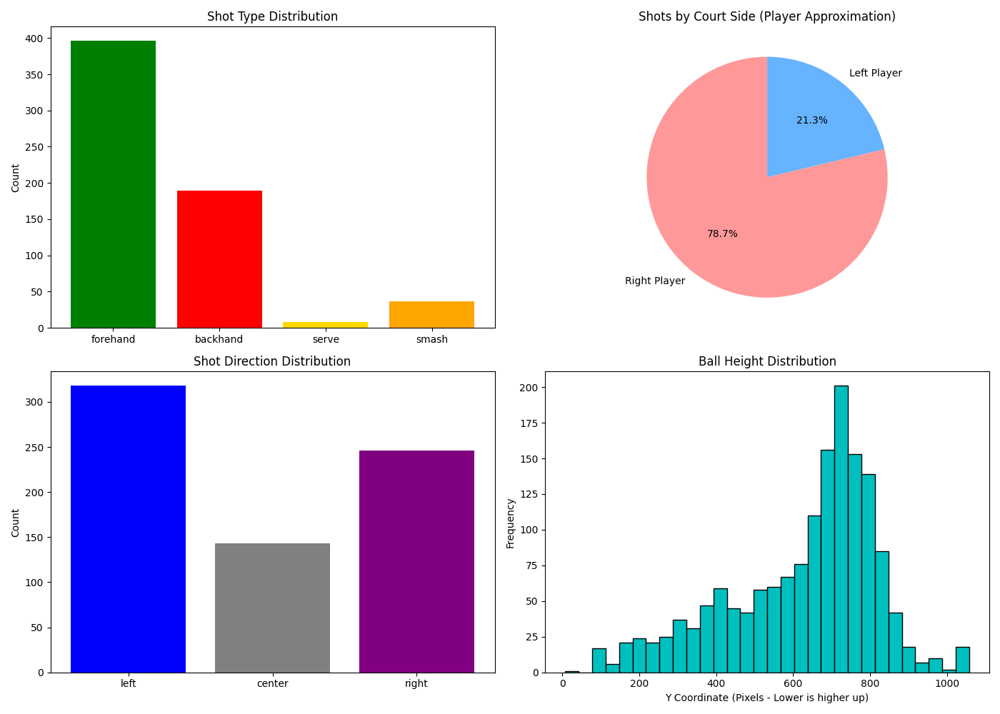

# Padel Game Analytics

An automated pipeline aimed at detecting players, rackets, and balls in padel games, tracking trajectories, identifying bounce/hit events, and classifying shot types (Forehand, Backhand, Serve, Smash).

## ⚙️ Setup & Installation
1. **Clone the repository:**
   ```bash
   git clone https://github.com/Abhijeet-KC/Padel-Game-Analytics.git
   cd Padel-Game-Analytics
   ```
2. **Create a virtual environment:**
   ```bash
   python -m venv venv
   source venv/Scripts/activate  # On Windows: venv\Scripts\activate
   ```
3. **Install dependencies:**
   ```bash
   pip install -r requirements.txt
   ```
4. **Run the pipeline:**
   ```bash
   python src/main.py
   ```

## 🚀 Demo Video
Watch the full inference demo of the pipeline directly below:

https://github.com/Abhijeet-KC/Padel-Game-Analytics/raw/main/demo/Demo_Project.mp4

## 📊 Output Files & Models
All executed results and model predictions are placed in `outputs/`. The active models utilized are `models/yolo26m.pt` (Object tracking natively) and `models/pose_landmarker_lite.task` (Mediapipe pose heuristics).
- **`inference_annotated_video.mp4`**: Fully annotated inference video showing player bounding boxes (green), racket bounds (red), tracked ball path (red/orange interpolated), hitting events, and directional trajectories.
- **`inference_ball_trajectory.csv`**: Frame-by-frame ball coordinate tracing. Contains fields `[frame, x, y, visible, interpolated]` for precise trajectory analysis.
- **`inference_detections.json`**: Structured JSON metadata containing shot predictions, frame detections, and bounce occurrences `{"frame", "x", "y"}`.
- **`dashboard.png`**: The rendered matplotlib visualizations shown below.

### Analytical Dashboard

*The dashboard summarizes shot distributions (Forehand vs Backhand vs Serve/Smash) and maps bounce geometries across the court space.*

## 🧠 Methodology & Approach Explanation

Our fundamental approach involves a multi-pass vision pipeline leveraging YOLO object detection combined with Scipy-based motion interpolation and heuristic tracking logic:
1. **Detection & Tracking (Pass 1):** Utilized `yolo26m.pt` with native ByteTrack (`bytetrack.yaml`) assigning consistent cross-frame IDs natively for Players, Rackets, and Balls. We applied localized heuristics to filter out background players by clamping legitimate player IDs strictly to bounding boxes overlapping with recognized padel rackets. 
2. **Ball Interpolation (Pass 2):** To handle high-speed motion blur and frame occlusion, we extracted the subset of visible ball frames and applied **`scipy.interpolate.interp1d`** (linear interpolation) to perfectly bridge and estimate missing sub-trajectories smoothly.
3. **Event Analytics & Shot Classification (Pass 3):** 
   - **Bounce Detection:** Calculus-based velocity extrema—if the ball was accelerating downwards (y-axis velocity `> 0`) and instantly deflects upward (`< 0`) within the court's lower threshold ratio (0.8), it is logged as a bounce.
   - **Spine-Based Shot Classification:** For detected hits, we passed the cropped player bounding box securely into Mediapipe's `pose_landmarker_lite`. By calculating the midpoint between the left and right shoulders (`spine_x`), we compared the ball's X coordinate to the spine's position. Factoring in handedness mapping (which wrist is closer), we accurately classify `Forehand` vs `Backhand`. `Serve` and `Smash` are classified dynamically using vertical wrist-to-shoulder ratios.

During development, multiple neural network architectures were formally evaluated:
- **Baseline YOLOv8n:** Struggled heavily with tracking consistency and completely failed at racket identification.
- **Fine-tuning YOLOv11m:** Fine-tuned on the open-source `padeltracker100` dataset for 30 epochs. Player/ID tracking became excellent, but we lacked a crisp padel-exclusive 5-point dataset for rackets (requiring tennis `racketvision` blending). Time constraints prevented full realization.
- **Open-Source Tracking Models:** Explored `TrackNet`, `InpaintNet`, `court_keypoint`. While highly specialized, they posed massive architectural alignment snags for our unified tracked timeframe.
- **Final Decision:** `yolo26m` securely paired with Mediapipe heuristics reliably provided the most stable, out-of-the-box analytics structure for evaluating padel matches without relying solely on limited custom fine-tunes.

## ⚠️ Challenges Faced
- **Ball Flickering & Motion Blur:** Ball tracking suffers from a severe flickering effect because standard YOLO configurations struggle with extremely small, high-velocity blurred objects natively without extensive temporal heat-map integrations.
- **Shot Classification Quirks:** While the spine-based alignment captures most strokes correctly, certain specific hitting angles cause "Serves" to be occasionally misclassified as "Forehands". Relying purely on 2D bounding boxes vs deep 3D pose rotational mapping guarantees a margin of hit-prediction error.
- **Severe Background Noise:** Given standard overhead camera angles, full inference matches occasionally mapped up to 4 simultaneous active courts actively playing in the deep background. This heavily spawned extra balls and false-positive player outlines that constantly fought with the main tracker logic, disrupting clean ID persistence compared to the clean prototype sample video.

## 🔮 Future Improvements
To elevate this analytics tool into production-grade performance, distinct improvements would be architected:
1. **Fine-Tuning a TrackNet / YOLO Hybrid:** Instead of evaluating padel games via standard COCO classes (`sport ball`, `person`), manually processing and training an active heat-map mapping architecture strictly on padel datasets. This resolves the aggressive ball flickering instantly.
2. **Deep-Sort & Homography Matrix Integration:** Programmatically calculating homography matrix limits to transition the classic 2D perspective planes into a true top-down 3D bird's-eye-view space. All tracking coordinates, shot physics, and distances would scale to real-world geometric reality.
3. **Dynamic Court Masking:** Actively implementing semantic masking (segmentation) models across the bounds of the specific main padel court, actively isolating out the neighboring background courts entirely.

---
**Branch Structure Refactoring:** 
- The experimental repository branch `exp2` has been elevated to the new `main` production branch, transitioning the earliest legacy prototype logic to branch `exp0`.
- All unused modeling weights were pruned to optimize repository space, retaining only `yolo26m.pt` and `pose_landmarker_lite.task`.